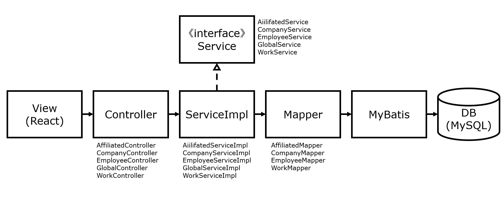
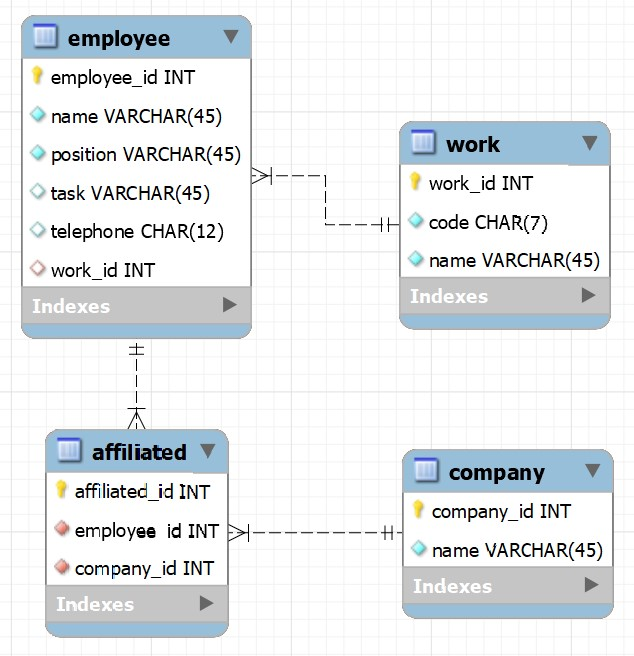

# 1조_이승현

## 프로젝트 환경
- Build: Gradle 7.4.1
- Language: Java 11
- Spring Boot 2.6.7
- MyBatis 3
- MySQL 8.0.29
- Packaging: Jar
- Front-end: React.js

## 프로젝트 구조

## ERD

## 화면
1. 메인 화면
   

2. 생성 화면
   

3. 수정 화면
   

4. 삭제 화면
   
   
5. 엑셀 파일 로드 화면
   
