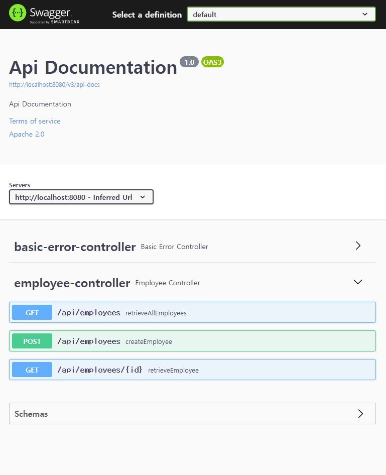
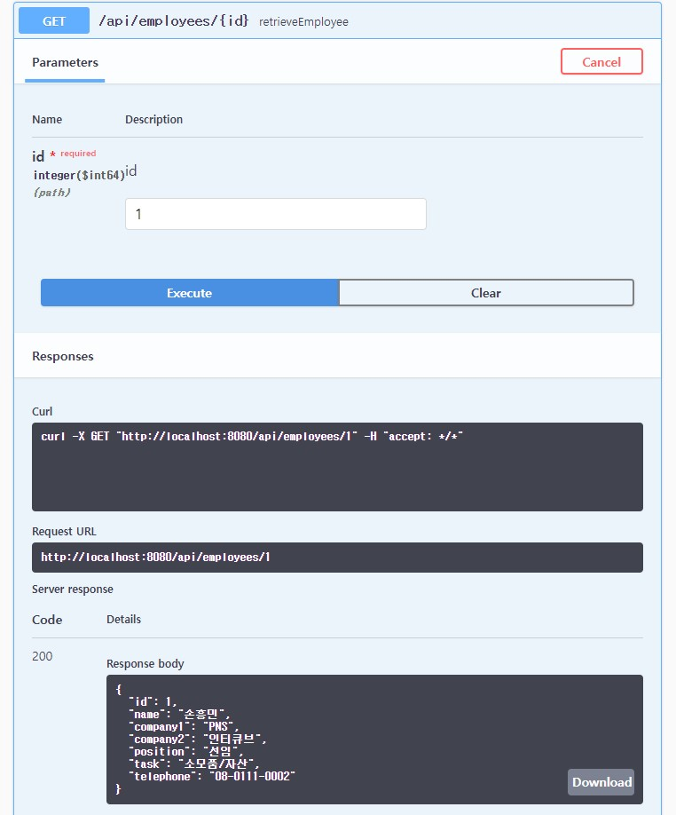

# 1조_이승현

## 프로젝트 환경
- Build: Gradle
- Language: Java
- Java Version: 11
- Spring Boot Version: 2.6.7
- Packaging: Jar

## 기술 스택
- Spring Boot
- MyBatis
- MySQL

## 프로젝트 구조

## ERD

## Swagger UI

